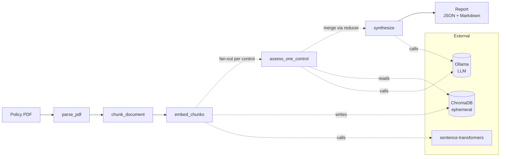
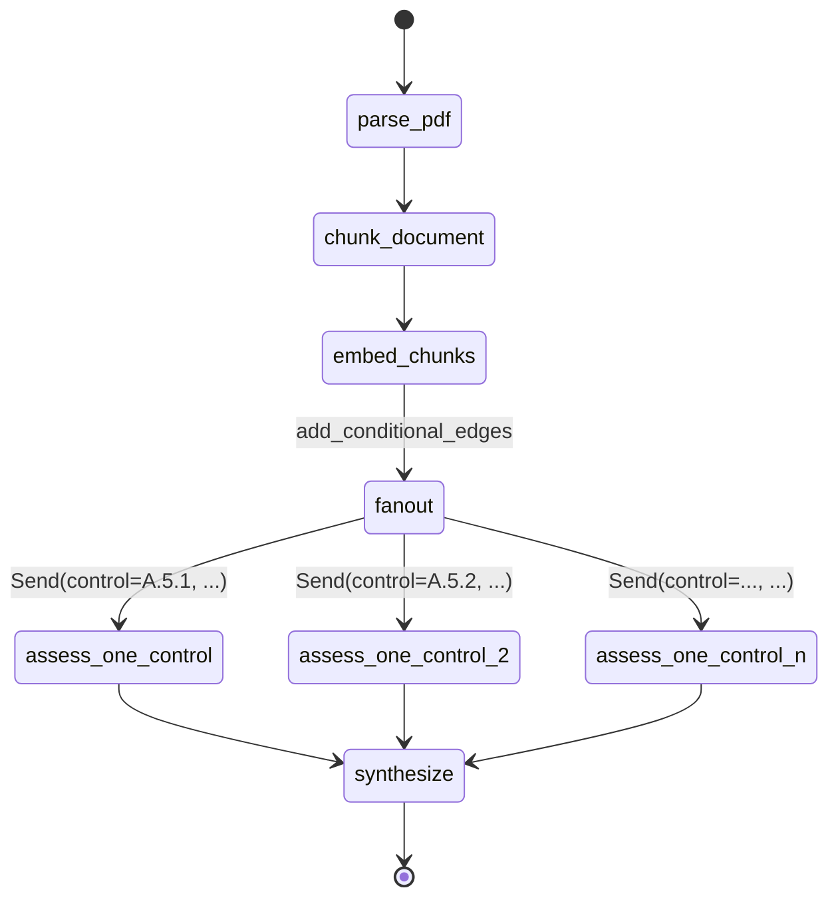
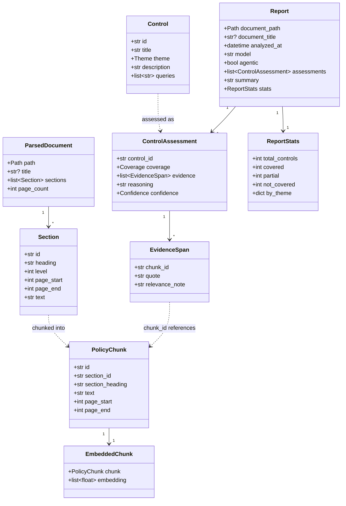
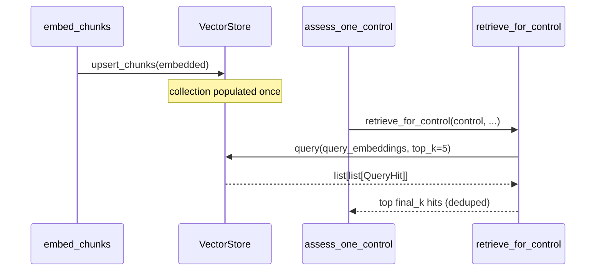
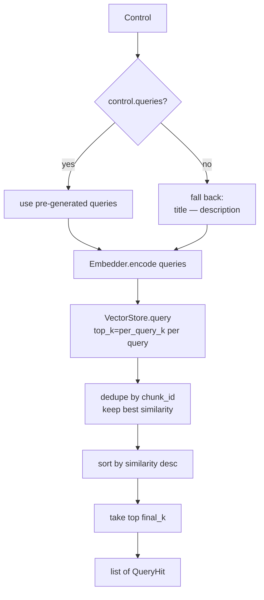
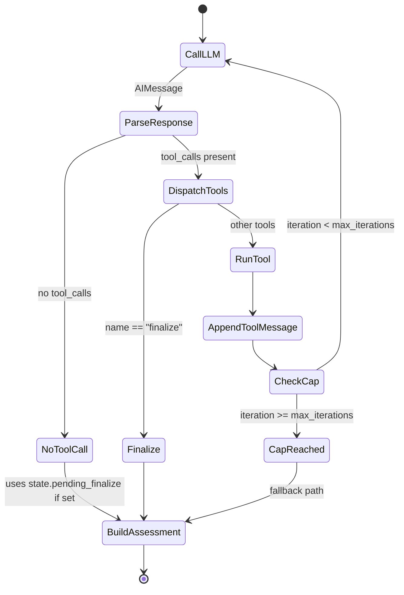
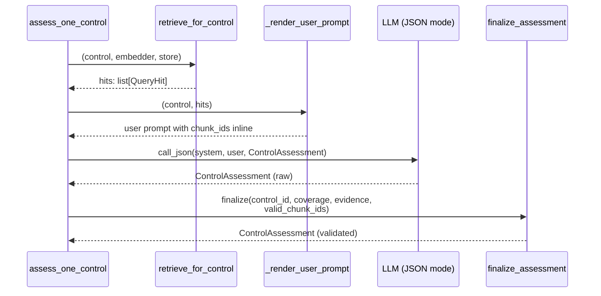
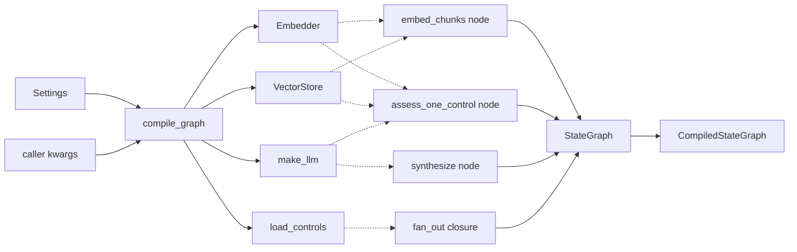

# Architecture

This document describes the runtime architecture of `ai-auditor`: how a policy
PDF becomes a gap-analysis report, what each stage does, and the design choices
that shape the code.

The pipeline has two assessment paths — **deterministic** (multi-query
retrieval + JSON-mode structured output) and **agentic** (a bounded ReAct loop
with tools). They share the same graph topology and the same data model,
differing only in the per-control assessment node. Both are covered here; the
agentic path is opt-in via `--agentic`.

---

## 1. Overview

`ai-auditor` reads an organisation's security policy PDF and checks it against a
curated subset of ISO 27001:2022 Annex A controls. For each control, it decides
whether the policy `covered`, `partial`ly covered, or `not_covered` the control,
cites the evidence, and writes a Markdown + JSON report.

The pipeline runs entirely on the user's machine: embeddings are computed with
`sentence-transformers`, inference is served by a local Ollama, and the vector
store is an in-memory ChromaDB collection that is discarded when the run ends.
There is no cloud inference and no per-run cost.

### Design principles

- **Local-first.** No policy content ever leaves the host. Replacing Ollama with
  a hosted provider is a one-function change (`ai_auditor.llm.make_llm`) but
  that choice is deliberately not the default.
- **Ephemeral state.** The vector store is created, populated, queried, and
  thrown away per run. Nothing persists between runs by default.
- **Deterministic by default.** Multi-query retrieval + JSON-mode structured
  output is the baseline; the agentic path is opt-in.
- **Structured outputs at every LLM boundary.** LLM calls return validated
  Pydantic models, not free-form text. Invalid outputs get one self-correcting
  retry; invalid citations are dropped post-hoc.
- **Explicit dependencies.** Embedder, vector store, LLM, and control corpus
  are resolved once in `compile_graph` and captured in node closures. No module
  singletons, no hidden globals — tests inject mocks via kwargs.

### System diagram



The rest of this document walks through each stage and the conventions that tie
them together.

---

## 2. The LangGraph pipeline

The pipeline is a [LangGraph](https://github.com/langchain-ai/langgraph)
`StateGraph`, assembled in `src/ai_auditor/graph/build.py`. LangGraph gives us
three things that matter for this project:

1. **A state-machine model.** Nodes are pure functions from state to a state
   update; edges declare the flow. There is no orchestrator class to maintain.
2. **Parallel fan-out** with automatic merging via state reducers — we dispatch
   one assessment branch per control and LangGraph concatenates their results.
3. **Free observability.** LangChain callbacks and MLflow tracing hook into
   `graph.invoke(..., config={"callbacks": [...]})` without changes to nodes.

### Topology



The flow is linear until `embed_chunks`. Then a `fan_out` function
(`build.py:72`) emits one `Send` per control, triggering parallel invocations of
`assess_one_control`. LangGraph's `operator.add` reducer on
`MainState.assessments` (`state.py:35`) concatenates the per-branch results back
into a single list, which `synthesize` consumes.

### Compile-time branching

`compile_graph(..., agentic=False)` chooses which assessment node to register —
it is **not** a runtime branch. One run uses one path for every control. This
keeps the graph simple and makes runs reproducible; at the cost that you cannot
A/B-test the two paths in a single invocation.

```python
assess_node = (
    make_agentic_assess_node(embedder, store, llm)
    if agentic
    else make_assess_one_control_node(embedder, store, llm)
)
builder.add_node("assess_one_control", assess_node)
```

Both factories return a function with the same signature — LangGraph sees one
node either way. The difference is entirely inside the node's body (Sections
4.5, 6, and 7).

---

## 3. State schema

State lives in `src/ai_auditor/graph/state.py` and is defined with `TypedDict`,
not Pydantic — LangGraph treats state as a plain dict that nodes read and merge
into. Validation happens at the domain-model layer (Section 5).

### `MainState`

The top-level state carried through the graph:

| Field            | Type                                             | Written by        | Read by                       |
| ---------------- | ------------------------------------------------ | ----------------- | ----------------------------- |
| `document_path`  | `Path`                                           | caller            | `parse_pdf`, `synthesize`     |
| `parsed`         | `ParsedDocument`                                 | `parse_pdf`       | `chunk_document`, fan-out     |
| `chunks`         | `list[PolicyChunk]`                              | `chunk_document`  | `embed_chunks`                |
| `assessments`    | `Annotated[list[ControlAssessment], operator.add]` | `assess_one_control` (per branch) | `synthesize` |
| `report`         | `Report`                                         | `synthesize`      | caller                        |

The reducer on `assessments` is what makes fan-out work: each parallel branch
returns `{"assessments": [one_assessment]}` and LangGraph concatenates them.

### `PerControlState`

The payload `Send`-dispatched to each fan-out branch:

```python
class PerControlState(TypedDict):
    control: Control
    parsed: ParsedDocument
```

`parsed` is only read by the agentic path (for `list_sections` / `read_section`
tools); the deterministic path ignores it. It is carried anyway because the
fan-out dispatcher doesn't know which path was compiled.

### What is deliberately **not** in state

Embeddings, the vector store handle, and the LLM client are **not** in state.
They are captured in node closures at compile time. Putting them in state would
bloat message payloads (embeddings are large), and it would tempt callers to
mutate them mid-run.

---

## 4. Node reference

Each node is a pure function (or a closure over DI dependencies) that takes a
state dict and returns a partial update.

### 4.1 `parse_pdf` — `graph/nodes/parsing.py`

**Purpose.** Extract heading-delimited sections from a PDF.

**Inputs.** `document_path`.
**Outputs.** `parsed: ParsedDocument`.

Uses `pymupdf`. Heading detection is heuristic: a span is a heading if it is
rendered in a font ≥ `1.15×` the body median, under 140 characters, or starts
with a numeric prefix (`1.`, `1.1`, `A.1`, `Section 5`, roman numerals). A
document with no detectable headings becomes a single synthetic section so the
rest of the pipeline still produces a valid output.

**Non-obvious.** The parser is font-driven, not TOC-driven. Policies without
structured headings still parse; the downstream chunker picks up the slack.

### 4.2 `chunk_document` — `graph/nodes/chunking.py`

**Purpose.** Break each section into bounded, overlapping chunks suitable for
embedding + LLM context.

**Inputs.** `parsed`.
**Outputs.** `chunks: list[PolicyChunk]`.

Targets ~220 words per chunk with ~40 words of overlap, splitting on sentence
boundaries (`(?<=[.!?])\s+(?=[A-Z0-9])`). Sections smaller than the target
become a single chunk. Each chunk carries `section_id`, `section_heading`, and
page bounds as metadata for later citation.

**Non-obvious.** No real tokenizer is used. Word count is a cheap approximation
(1 token ≈ 0.75 words); the bound is conservative enough that we never blow the
embedding or LLM context budget, and we avoid pulling in a tokenizer
dependency.

### 4.3 `embed_chunks` — `graph/nodes/embedding.py`

**Purpose.** Embed all chunks in one batch and upsert them into the vector
store.

**Inputs.** `chunks`.
**Outputs.** `{}` (side-effect only; the store is populated).

Returns an empty state update because the embeddings live in the store
thereafter — carrying them through state would bloat every message without
adding information. This is why the store is a closure-captured dependency
rather than a state field: nodes downstream read it directly.

### 4.4 Fan-out dispatcher — `build.py:72`

Not a node; a conditional-edge function that returns a list of `Send` objects,
one per control:

```python
def fan_out(state: MainState) -> list[Send]:
    parsed = state["parsed"]
    return [
        Send("assess_one_control", {"control": c, "parsed": parsed})
        for c in resolved_controls
    ]
```

LangGraph runs these in parallel (bounded by its internal executor). Each
branch produces one `ControlAssessment` and the state reducer concatenates
them.

### 4.5 `assess_one_control` — assessment node

Same slot in the graph, two possible implementations chosen at compile time
(Section 2). Both take a `PerControlState` and return
`{"assessments": [ControlAssessment]}`; both close over `(embedder, store,
llm)` at compile time.

#### 4.5a Deterministic path — `graph/nodes/assessment.py`

`make_assess_one_control_node(embedder, store, llm)` composes two steps:

1. `retrieve_for_control(control, embedder, store)` — multi-query retrieval
   with a fixed query budget (Section 6.2).
2. `assess_control(control, hits, llm)` — one JSON-mode LLM call, then
   `finalize_assessment` (Section 7.5).

Retrieval runs once; the LLM sees every hit inline in its prompt. One LLM
call per control.

#### 4.5b Agentic path — `graph/nodes/agentic_retrieval.py`

`make_agentic_assess_node(embedder, store, llm, max_iterations=6)` wraps
`run_retrieval_agent`, which runs a bounded ReAct loop with four tools
(Section 6.3). The loop is the node — retrieval and assessment are
interleaved rather than separated.

- Up to `max_iterations` LLM calls per control (default 6).
- The agent decides what to retrieve and when to stop; it signals completion
  by calling the `finalize` tool.
- On iteration-cap or missing `finalize`, the node returns a low-confidence
  `not_covered` fallback rather than raising — the caller always gets an
  assessment.
- The agent's final verdict flows through the **same** `finalize_assessment`
  helper as the deterministic path (Section 7.5).

### 4.6 `synthesize` — `graph/nodes/reporting.py`

**Purpose.** Aggregate per-control results into a single `Report`.

**Inputs.** `assessments`, `parsed`, `document_path`.
**Outputs.** `report: Report`.

Aggregation itself is deterministic: counts of `covered` / `partial` /
`not_covered`, plus a by-theme breakdown derived from the Annex A prefix
(`A.5.*` → Organizational, `A.6.*` → People, `A.7.*` → Physical, `A.8.*` →
Technological). The executive summary is the one place the LLM produces prose;
when `summary_llm=None` (e.g. in tests), a plain deterministic paragraph is
emitted instead.

---

## 5. Data model

Domain models live in `src/ai_auditor/models.py`. They are Pydantic (unlike
state, which is `TypedDict`) because they carry validation for LLM-produced
structured outputs and are the stable schema written to `report.json`.



### Invariants the code depends on

- `Control` is `frozen=True` — the same instance is shared across branches.
- `EvidenceSpan.chunk_id` **must** reference a chunk actually retrieved for
  that control; the assessment finalizer enforces this (Section 7).
- `ControlAssessment.coverage == "not_covered"` implies `evidence == []`.
- `ControlAssessment.coverage in {"covered", "partial"}` implies at least one
  surviving `EvidenceSpan`.

---

## 6. Retrieval layer

### 6.1 Vector store — `src/ai_auditor/vector_store.py`

A thin wrapper over ChromaDB's `EphemeralClient`. One run creates one
collection (`policy_chunks`, cosine space) and disposes of it on exit.



**Similarity convention.** `QueryHit.similarity = 1.0 - chroma_distance`, so
`similarity ∈ [0, 1]` with higher = better. Callers never see raw distances.

**Persistence seam.** `_make_client()` is the one place persistence is
decided — swap `EphemeralClient()` for `PersistentClient(path=...)` to make
collections survive runs.

### 6.2 Deterministic multi-query retrieval — `graph/nodes/retrieval.py`

For each control, `retrieve_for_control` runs several query phrasings and
merges the hits:



Defaults: `per_query_k=5`, `final_k=10`. The pre-generated queries live in
`data/controls/iso27001_annex_a.yaml` under each control's `queries` key. They
exist because a single embedding of an Annex A control title rarely finds the
right phrasing in a policy document — the vocabulary gap between
"Information security in project management" and a policy section titled
"Secure development lifecycle" is large, and multi-query closes most of it.

**Dedupe policy.** When two queries retrieve the same chunk, we keep the copy
with the highest similarity and drop the rest. We lose the signal that
"multiple queries agreed this is relevant"; in exchange the prompt stays
short.

### 6.3 Agentic retrieval — `graph/nodes/agentic_retrieval.py`

In the agentic path, retrieval and assessment are not two separate steps —
they are the same bounded ReAct loop. The LLM decides which queries to run,
whether to read full sections, and when to stop. Retrieval history
accumulates in a mutable per-run state object the tools read and write.

#### Tools

Four `StructuredTool`s are bound to the model via `llm.bind_tools([...])`.
Their argument schemas are Pydantic classes so the model receives a strict
function-calling schema.

| Tool             | Purpose                                                                   |
| ---------------- | ------------------------------------------------------------------------- |
| `list_sections`  | Return the document's table of contents (section id, heading, pages).     |
| `search_policy`  | Semantic search — returns top-k chunk ids with text previews.             |
| `read_section`   | Return one section's full text verbatim, given a `section_id`.            |
| `finalize`       | Record the coverage judgment and terminate the loop.                      |

`search_policy` embeds the query on the fly (single query, not multi-query),
queries the same ChromaDB collection the deterministic path uses, and
appends every returned `QueryHit` into `state.seen_hits`. This accumulator
is what eventually backs the `EvidenceSpan` list in the final assessment —
the agent can only cite chunks it actually retrieved.

#### The loop



Step by step (`run_retrieval_agent`, `agentic_retrieval.py:94`):

1. Seed the conversation with the agent system prompt
   (`src/ai_auditor/prompts/retrieval_agent.md`) and a user message
   identifying the control.
2. For up to `max_iterations` (default 6): invoke `llm_with_tools`, append
   the response, dispatch any tool calls, and append a `ToolMessage` for
   each result.
3. A tool call named `finalize` is intercepted in the outer loop — its args
   are stashed in `state.pending_finalize` and the loop breaks without
   running `finalize` as a real tool.
4. If the model returns text with no tool calls, the loop ends early.
5. After the loop, `_build_assessment` turns the agent's state into a
   `ControlAssessment`.

#### Termination paths

| Condition                                             | Result                                                                 |
| ----------------------------------------------------- | ---------------------------------------------------------------------- |
| Agent called `finalize`                               | Normal path — verdict and cited ids go through `finalize_assessment`.  |
| Agent answered without tool calls before finalising   | Fallback `not_covered` with low confidence.                            |
| `max_iterations` reached with no `finalize`           | Same fallback; an `[meta]` note is appended to `reasoning`.            |
| Agent called `finalize` but with unknown coverage/confidence strings | Coerced via `_coerce_coverage` / `_coerce_confidence`, defaulting to `not_covered` / `low`. |

The loop never raises to the caller. Every control always gets a
`ControlAssessment`; the confidence and `reasoning` field make degraded
outputs auditable.

#### Agent-specific rules

- **`MIN_SEARCHES_BEFORE_NOT_COVERED = 2`.** If the agent finalises
  `not_covered` after fewer than two `search_policy` calls, confidence is
  forced to `low` — it didn't look hard enough to be confident. This rule
  doesn't exist on the deterministic path (which has a fixed query budget).
- **Fabricated citations are dropped** by the shared `finalize_assessment`
  (Section 7.5), not by the agent loop. The agent's `seen_hits` keyset is
  passed in as `valid_chunk_ids`.

#### Trade-offs vs deterministic

| Axis           | Deterministic                      | Agentic                                      |
| -------------- | ---------------------------------- | -------------------------------------------- |
| LLM calls      | 1 per control (+1 retry on failure)| Up to `max_iterations` per control           |
| Retrieval      | Fixed: pre-authored multi-query    | Agent chooses queries; can `read_section`    |
| Latency        | Low, predictable                   | Higher, variable                             |
| Cost           | Low                                | Higher (more tokens, more round-trips)       |
| Failure mode   | Raises on double-validation error  | Never raises — degraded assessment instead   |
| Best for       | Baseline runs, CI, eval grids      | Hard controls where fixed queries miss       |

---

## 7. Assessment layer

### 7.1 Deterministic per-control flow



### 7.2 Agentic per-control flow

```mermaid
sequenceDiagram
    participant N as assess_one_control<br/>(agentic)
    participant A as run_retrieval_agent
    participant L as LLM (tool-calling)
    participant T as tools<br/>(search/read/list)
    participant S as VectorStore
    participant F as finalize_assessment

    N->>A: (control, parsed, embedder, store, llm)
    loop up to max_iterations
        A->>L: messages + tool schemas
        L-->>A: AIMessage with tool_calls
        alt tool is finalize
            A->>A: stash FinalizeArgs; break
        else other tools
            A->>T: dispatch
            T->>S: query / read sections
            S-->>T: hits / section text
            T-->>A: ToolMessage
        end
    end
    A->>A: _build_assessment<br/>(coerce types, enforce min-searches)
    A->>F: finalize(control_id, coverage,<br/>evidence_spans, valid_chunk_ids=seen_hits)
    F-->>A: ControlAssessment (validated)
    A-->>N: ControlAssessment
```

Same shape at the boundary as the deterministic flow: one `ControlAssessment`
out, every citation validated against real retrieved chunks. The loop body
differs; the contract with the rest of the graph does not.

### 7.3 Prompts

Two system prompts, loaded at import time via `importlib.resources`:

- `src/ai_auditor/prompts/assessment.md` — deterministic path. The user
  prompt, built by `_render_user_prompt`, contains control identity, each
  retrieved chunk inline (tagged with `chunk_id`, section heading, page
  range, similarity), and a footer reminding the model to cite only those
  `chunk_id`s. If retrieval returned no hits, the prompt short-circuits the
  model toward `not_covered`.
- `src/ai_auditor/prompts/retrieval_agent.md` — agentic path. The user
  prompt is just the control identity plus "investigate the policy using
  your tools, then call `finalize`". The model discovers evidence on its
  own.

### 7.4 Structured output

The two paths use different structured-output mechanisms, both anchored in
Pydantic schemas:

- **Deterministic — `call_json` in `llm.py`.** Invoke the LLM (configured
  with `format="json"`), parse with `ControlAssessment.model_validate_json`,
  and on `ValidationError` re-invoke once with the error quoted back. A
  second failure raises. One retry is enough for small local models that
  occasionally append prose or drop a key.
- **Agentic — `llm.bind_tools(...)`.** The four tool schemas
  (`SearchPolicyArgs`, `ReadSectionArgs`, `ListSectionsArgs`, `FinalizeArgs`)
  are Pydantic `BaseModel`s. LangChain exposes them to the model as a
  function-calling schema and LangGraph's provider layer does the coercion.
  The `finalize` tool args are what eventually become the assessment verdict.

### 7.5 Post-validation — `finalize_assessment`

Both paths funnel through the same helper in
`src/ai_auditor/graph/nodes/assessment.py`. Two protections apply:

1. **Drop fabricated citations.** Any `EvidenceSpan.chunk_id` not in the
   retrieved hit set is dropped. The model doesn't get to invent references
   to chunks it never saw.
2. **Coerce unsupported verdicts.** If coverage is `covered` or `partial`
   but no citations survive, coverage is forced to `not_covered` and
   confidence to `low`. A `[post-validation]` note is appended to
   `reasoning` so the downgrade is auditable.

The `valid_chunk_ids` set differs per path: deterministic uses the set of
retrieved hits for that control; agentic uses `state.seen_hits` — the union
of every chunk the agent retrieved via `search_policy`.

The agentic path layers two extra rules on top, in `_build_assessment`:

3. **`MIN_SEARCHES_BEFORE_NOT_COVERED`.** A `not_covered` verdict after
   fewer than 2 `search_policy` calls is kept, but confidence is forced to
   `low`. Not enough looking to be confident.
4. **`[meta]` iteration-cap note.** When the agent hit `max_iterations`
   before calling `finalize`, the reasoning field gets an appended note so
   consumers can distinguish "clean completion" from "loop ran out".

`finalize_assessment` is the single enforcement point for "evidence must be
real and must support the verdict". Both paths share it — one truth about
what makes an assessment defensible.

---

## 8. LLM integration

### Factory — `src/ai_auditor/llm.py`

One function, `make_llm(settings, *, json_mode, temperature)`, returns a
`BaseChatModel`. Today the body constructs a `ChatOllama`; the return type is
the provider-neutral LangChain interface so callers don't depend on Ollama.
Swapping providers means replacing the body — everything else in the pipeline
talks to `BaseChatModel.invoke` (+ `bind_tools` for the agentic path) and
nothing more.

`compile_graph` picks the mode per path:

```python
resolved_llm = make_llm(settings, json_mode=not agentic)
```

- Deterministic → `json_mode=True` → Ollama's `format="json"`. Equivalents
  for other providers (`response_format={"type": "json_object"}` for OpenAI,
  etc.) would be added in `make_llm`.
- Agentic → `json_mode=False`. The agent calls `llm.bind_tools([...])` on
  the result to attach tool schemas; JSON-mode and tool-calling are
  mutually exclusive at the Ollama layer.

### Prompts as files — `src/ai_auditor/prompts/`

- `assessment.md` — system prompt for the deterministic assessment node.
- `query_generation.md` — used offline to pre-generate `control.queries`.
- `retrieval_agent.md` — system prompt for the agentic path; instructs the
  model on the available tools and the expected workflow.

Prompts are loaded at import time via `importlib.resources` and are shipped
inside the package.

### Summary generation

`synthesize` optionally calls the LLM once at the end to produce an executive
summary paragraph. This call does **not** use JSON mode — it's a short prose
generation, and the prompt forbids headings, bullets, and preambles. When
`summary_llm=None` (tests, or if the caller wants to skip), a deterministic
one-liner is emitted instead.

---

## 9. Configuration and dependency injection

### Settings — `src/ai_auditor/config.py`

All runtime config is one Pydantic `BaseSettings` class. Values come from the
process environment or a `.env` file (same keys).

| Field                   | Default                                                  | Purpose                              |
| ----------------------- | -------------------------------------------------------- | ------------------------------------ |
| `ollama_host`           | `http://localhost:11434`                                 | Ollama server URL                    |
| `ollama_model`          | `qwen2.5:7b-instruct`                                    | Model tag pulled by Ollama           |
| `embedding_model`       | `sentence-transformers/all-MiniLM-L6-v2`                 | Embedding model                      |
| `controls_path`         | `data/controls/iso27001_annex_a.yaml`                    | Control catalog                      |
| `mlflow_tracking_uri`   | `""`                                                     | Empty = local `./mlruns`             |
| `mlflow_experiment`     | `ai-auditor`                                             | MLflow experiment name               |

There is exactly one `Settings` instance per CLI invocation, built by
`load_settings()` and passed into `compile_graph`.

### Dependency injection pattern

`compile_graph` takes five optional overrides — `controls`, `embedder`,
`store`, `assessment_llm`, `summary_llm`. Each has a default constructed from
`Settings`. Caller-supplied kwargs win; defaults fill the rest.

```python
resolved_embedder = embedder if embedder is not None else Embedder(settings.embedding_model)
resolved_store    = store    if store    is not None else VectorStore()
resolved_llm      = assessment_llm if assessment_llm is not None else make_llm(settings, json_mode=not agentic)
```

The resolved dependencies are captured in **node-factory closures** (e.g.
`make_assess_one_control_node(embedder, store, llm)` returns a function that
has those three references baked in). No module singletons, no `get_llm()`
ambient helpers.

This pattern costs some boilerplate — every node that needs a dependency gets
a factory — but gains two things:

- Tests inject mocks via `compile_graph(..., assessment_llm=FakeLLM())`.
- Multiple pipelines can run in the same process with different
  configurations without touching globals.



---

## 10. Observability

Covered in depth in `docs/evaluation.md` (separate); a short note here for
completeness.

The pipeline is instrumented in two complementary ways:

- **LangChain callbacks** — `EvalCallbackHandler` counts LLM and tool
  invocations and measures wall time. Attached per-run via
  `graph.invoke(..., config={"callbacks": [handler]})`.
- **MLflow tracing** — `mlflow.langchain.autolog()` records every LLM call as
  a span; manual `@mlflow.trace` decorators wrap higher-level phases. A
  session-level parent run holds per-document/per-strategy child runs.

The agentic path adds one extra hook: `@mlflow.trace(name="retrieval_agent")`
on `run_retrieval_agent` creates a parent span per control, tagged with
`control_id` and `control_title`. Each LLM call and tool invocation inside
the loop shows up as a nested span under that parent — so an operator can
open the trace for one control and read exactly which queries the agent
tried and in which order. The deterministic path has no equivalent wrapper:
a single LLM call per control doesn't need one.

Both are optional. When MLflow is disabled, tracing is a no-op; the pipeline
doesn't change shape.

---

## 11. Report generation

`synthesize` produces a `Report`. `src/ai_auditor/render.py` is responsible for
writing it to disk:

- `report.json` — the serialised Pydantic model, suitable for downstream
  tooling.
- `report.md` — a human-readable Markdown rendering with a coverage overview,
  a per-theme table, and per-control findings with evidence citations
  (quoted verbatim, linked by `chunk_id` and page number).

Both are written to the `--output` directory (default `out/`).

---

## 12. Key design trade-offs

These are the decisions most likely to change if the project's requirements
shift. Each is called out so a future reader can see *why* the code looks the
way it does.

### Ephemeral vector store

**Choice.** `EphemeralClient`, fresh collection per run.
**Why.** Simplicity, isolation between runs, no state management.
**What a persistent store would enable.** Faster re-runs on the same policy,
cross-document analysis, "what changed since last run" diffing.
**Where to change it.** `vector_store.py::_make_client`.

### Compile-time path selection (deterministic vs agentic)

**Choice.** `agentic=True/False` fixes the assessment node at graph-build time.
**Why.** The graph stays simple; one run is reproducible end-to-end.
**Cost.** No A/B testing within a run. The eval script runs both paths as
separate invocations instead.

### Bounded agent loop (`max_iterations=6`)

**Choice.** The ReAct loop has a hard iteration cap and a `finalize`-or-
fallback termination rule. Exceeding the cap never raises; it produces a
low-confidence `not_covered` with an `[meta]` note.
**Why.** Predictable cost and latency per control — critical when you're
running 33 controls in parallel against a local model. A runaway loop on
one control shouldn't stall the whole run.
**Cost.** Hard controls that would benefit from a seventh round of search
get capped. The fallback is auditable (confidence=low, `[meta]` note), but
it is a degraded answer.
**Where to change it.** `agentic_retrieval.py::MAX_ITERATIONS_DEFAULT` or
the `max_iterations` kwarg on `make_agentic_assess_node`.

### Multi-query retrieval + dedupe-by-best

**Choice.** Multiple query phrasings per control; keep the highest-similarity
copy of each chunk.
**Why.** Closes the vocabulary gap between framework wording and policy
wording, at the cost of losing the "multiple queries agreed" signal.
**Alternative.** Reciprocal Rank Fusion would preserve the agreement signal
but is measurably harder to reason about when debugging a single hit.

### One-retry JSON validation

**Choice.** One structured-output call; one retry with the validation error
quoted back; then raise.
**Why.** Small local models occasionally emit a trailing sentence or a wrong
key — one retry fixes that. More retries rarely recover and burn tokens.
**Cost.** A hard schema break still kills the run — the caller sees a
`ValidationError`.

### Post-hoc citation filtering

**Choice.** Drop fabricated `chunk_id`s after the call; coerce unsupported
verdicts down.
**Why.** LLMs hallucinate citations under pressure. Filtering post-hoc is
cheaper and more defensible than prompting-until-perfect, and it's the same
code path the agentic finalizer uses.
**Cost.** A correctly reasoned verdict can be demoted if the model cited the
wrong chunk id for the right reason. The `[post-validation]` note in
`reasoning` makes the demotion visible.

### Closure-based DI

**Choice.** Dependencies resolved once in `compile_graph`; captured in node
closures.
**Why.** No globals, trivially mockable from tests, multiple pipelines can
coexist.
**Cost.** Every node that needs a dependency needs a factory function. The
boilerplate is visible in `build.py` and the `make_*_node` helpers.

---

## 13. Extension points

Short, prescriptive notes for common changes.

**Add a new pipeline node.**
Write a pure function (or a `make_*_node` factory if it needs DI), register it
in `build.py` with `add_node`, and wire an `add_edge` into place.

**Change the embedding model.**
Set `EMBEDDING_MODEL` in the environment (or pass `embedder=Embedder("...")`
to `compile_graph`). The model is loaded lazily on first `encode` call.

**Swap the LLM provider.**
Replace the body of `llm.py::make_llm` to return a different
`BaseChatModel`. Map `json_mode=True` to the provider's structured-output
convention (e.g. `response_format={"type": "json_object"}` for OpenAI).

**Add a new agentic tool.**
Define a Pydantic args schema (e.g. `class MyToolArgs(BaseModel): ...`),
add a function that reads/writes `_AgentState`, wrap it with
`StructuredTool.from_function(...)`, and append it to the list returned by
`_build_tools`. The agent's system prompt in
`src/ai_auditor/prompts/retrieval_agent.md` should also mention the tool or
the model won't know to use it.

**Persist the vector store across runs.**
Edit `vector_store.py::_make_client` to return
`chromadb.PersistentClient(path=...)`. The rest of the code is agnostic.

**Add a control or change the control set.**
Edit `data/controls/iso27001_annex_a.yaml`. Each entry needs `id`, `title`,
`theme`, `description`, and ideally a list of `queries`.

**Add a new output format.**
Add a renderer in `render.py` that consumes a `Report` and writes a file.
Call it alongside `render_markdown` in the CLI.
