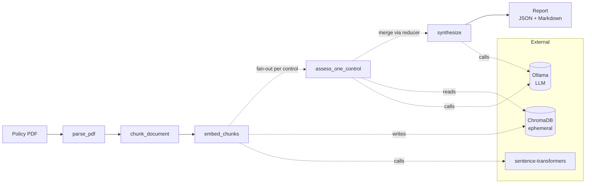
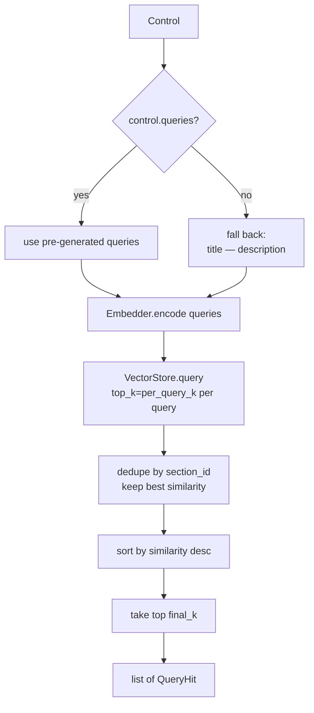
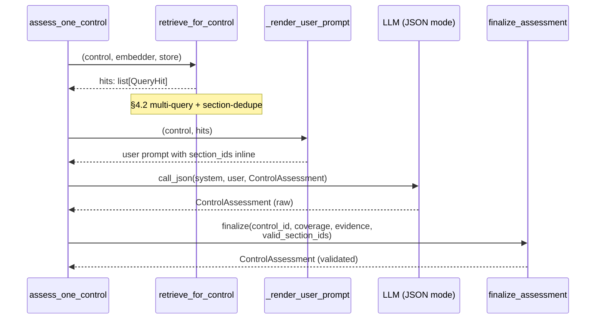
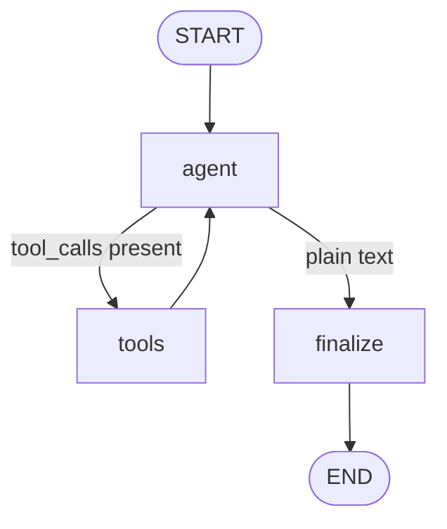
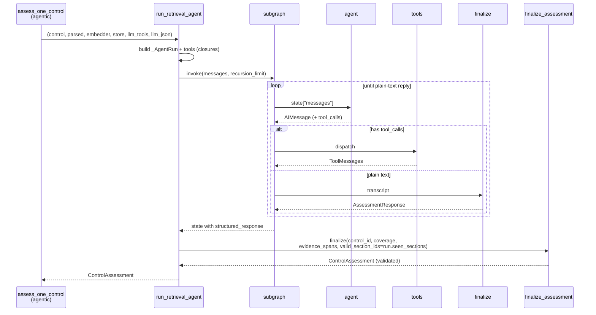

# Architecture

This document describes how a policy PDF becomes a gap-analysis report, and
the two assessment strategies the pipeline supports. The code is the
authoritative reference for field names and signatures — this doc focuses
on *why* the pieces are shaped the way they are, and how they fit together.

---

## 1. Problem statement

`ai-auditor` reads an organisation's security policy PDF and checks it
against a curated subset of ISO 27001:2022 Annex A controls. For each
control, it decides whether the policy is `covered`, `partial`ly covered,
or `not_covered`, cites the evidence, and writes a Markdown + JSON
report.

Four sub-problems shape the design:

1. **Vocabulary gap.** Annex A says "access control"; policies say
   "user permissions", "authorisation", "role-based access". A single
   embedding of the control title rarely finds the policy's treatment.
   This is the single most consequential retrieval failure mode and it
   drives the design of §4.
2. **Citation defensibility.** A verdict without a reproducible
   citation is useless to an auditor. Every `covered` / `partial`
   assessment must point to a section the system actually saw, and
   fabricated citations are dropped post-hoc rather than trusted.
3. **Local-only constraint.** No policy content leaves the host.
   Embeddings run with `sentence-transformers`, inference with a local
   Ollama, retrieval with an in-memory ChromaDB. Swapping to hosted
   providers is a one-function change at `ai_auditor.llm.make_llm`,
   but the default must stand on its own.
4. **Scale.** A full corpus is ~33 controls. A run needs to finish in
   minutes on a laptop, which puts a hard budget on per-control LLM
   calls.

### Two strategies

The pipeline has two assessment paths, selected at compile time:

- **Deterministic** — pre-generated multi-query retrieval (§4.2),
  one JSON-mode LLM call per control.
- **Agentic** — a per-control LangGraph subgraph (§6) where the LLM
  investigates with tools and a structured-response terminus produces
  the assessment.

Same graph topology, same data model, same `finalize_assessment`
post-validator at the boundary; different per-control node body.

### Design principles

- **Local-first** — default configuration runs entirely on the host.
- **Ephemeral state** — the vector store is created, populated,
  queried, and thrown away per run.
- **Deterministic by default** — agentic path is opt-in (`--agentic`).
- **Structured outputs at every LLM boundary** — Pydantic-validated
  with a one-shot self-correcting retry.
- **Explicit dependencies** — embedder, store, LLM, controls resolved
  once in `compile_graph` and captured in closures. No module
  singletons, no hidden globals; tests inject mocks via kwargs.

### System diagram



---

## 2. Document parsing

`parse_pdf` (`graph/nodes/parsing.py`) uses PyMuPDF to extract
heading-delimited `Section`s with page ranges. The parser is
**font-driven, not TOC-driven**: a span is treated as a heading if
it's rendered in a font ≥ 1.15× the body median, under 140
characters, or begins with a numeric prefix (`1.`, `1.1`, `A.1`,
`Section 5`, roman numerals). A document with no detectable headings
collapses to a single synthetic section so the pipeline still
produces a valid output.

The output is a `ParsedDocument` containing a list of `Section`s,
each carrying `id`, `heading`, `level`, `page_start`, `page_end`,
and the section's full text.

### Why section-level structure

Sections are the **citation unit**. Every evidence span in a final
report refers to a `section_id`, and readers can resolve that to a
page range via `Report.sections`. Anchoring citations at section
granularity (rather than chunk, character offset, or free-form quote)
keeps them stable across re-runs and legible to an auditor opening
the PDF to the cited page.

A consequence: the `read_section` tool in the agentic path (§6)
returns a section's full verbatim text, which means the agent can
reason about context the chunker split across boundaries.

---

## 3. Chunking

`chunk_document` (`graph/nodes/chunking.py`) breaks each `Section`
into bounded, overlapping `PolicyChunk`s for embedding and retrieval.

- **Target ~220 words** per chunk with **~40 words overlap**.
- Splits on sentence boundaries (`(?<=[.!?])\s+(?=[A-Z0-9])`).
- Sections smaller than the target become a single chunk.
- Each chunk carries `section_id`, `section_heading`, and page
  bounds as metadata — this metadata is what retrieval uses to
  surface the section later.

Word count is a cheap approximation for tokens (1 token ≈ 0.75
words); the bound is conservative enough to never blow the embedding
or LLM context budget, and it avoids pulling in a tokenizer
dependency.

### Why section-bounded chunks

A chunk never crosses a section boundary. That keeps two invariants
simple:

- **Citation resolution is trivial.** A retrieved chunk's
  `section_id` is its citation; no ambiguity about which section an
  excerpt "belongs to".
- **Section reads are additive to retrieval.** When the agent calls
  `read_section`, it sees content that's a strict superset of any
  chunk in that section — no overlap confusion, no risk of citing
  something outside the section's page range.

---

## 4. Query formulation

### 4.1 The vocabulary gap

The single biggest retrieval failure mode is that Annex A's phrasing
and policy phrasing diverge. A control titled "Information security
in project management" often matches a policy section called "Secure
development lifecycle" or "Change management" — but the cosine
similarity between those strings' embeddings is lower than you'd
hope. One query per control finds half the evidence on a good day.

Both strategies address this, with opposite mechanisms.

### 4.2 Pre-generated multi-query (deterministic)

Each entry in `data/controls/iso27001_annex_a.yaml` carries a
`queries` list of 3-5 short, policy-style paraphrases alongside the
formal `title` and `description`:

```yaml
- id: A.5.15
  title: Access control
  description: >-
    Rules to control physical and logical access ...
  queries:
  - role-based access reviewed quarterly
  - user permissions provisioning
  - authorisation for production systems
  - access revocation on termination
```

These are generated once, offline, via `scripts/generate_queries.py`
using the prompt in `prompts/query_generation.md`. The generation
pass runs at zero temperature and the output is committed to the
YAML — reproducible, auditable, free at runtime.

At retrieval time, `retrieve_for_control` (`graph/nodes/retrieval.py`)
embeds every query in the list, queries the vector store once per
phrasing, and unions the hits keeping the best similarity per
section:



Defaults: `per_query_k=5`, `final_k=10`. The section-level dedupe
matches the citation granularity — at most one excerpt per section
makes it into the assessment prompt.

**Trade-off.** Query quality is fixed at generation time. If the
policy uses vocabulary the pre-generated queries didn't anticipate,
retrieval misses and the assessment sees nothing to cite. But
because generation is offline, reruns on the same control corpus
are cost-free and comparable.

### 4.3 Agent-driven reformulation (agentic)

The agentic path ignores `control.queries` entirely. Instead, the
agent emits query strings itself, as the `query` argument to its
`search_policy` tool. Reformulation is emergent from:

- The retrieval-agent system prompt (`prompts/retrieval_agent.md`),
  which instructs the agent to use policy-style vocabulary and try
  different phrasings if first results are weak.
- The tool-arg description on `SearchPolicyArgs.query`
  ("Natural-language query, 5-12 words, policy-style wording") —
  this text ends up in the tool-calling schema the model sees, so
  it influences every `search_policy` invocation.
- The ReAct loop itself: after a weak search, the agent reads the
  tool result and decides what to try next.

There is no dedicated `reformulate` tool. The agent is already
generating the reformulation when it picks the next `query`
argument; wrapping that in a separate tool would be the model
calling itself.

**Trade-off.** Adaptive — the agent can react to mismatched
vocabulary in a way the pre-generated queries can't. Transparent
in the trace — every query and every result is a span in MLflow.
But every reformulation is an LLM turn, and behaviour shifts with
the model: qwen2.5:7b and gpt-4 don't reformulate the same way, so
runs aren't reproducible across infrastructure changes.

### 4.4 Not mutually exclusive

The two approaches aren't in conflict. A hybrid where the agent
seeds from `control.queries` as a starter set of phrasings (then
reformulates as needed) is a natural next step — not done today,
but worth flagging. It would need one extra injection of the
pre-generated queries into the agent's system prompt.

---

## 5. Deterministic graph

The outer pipeline is a LangGraph `StateGraph` assembled in
`graph/build.py`. It's identical between the deterministic and
agentic paths — only the per-control `assess_one_control` node
body differs. This section covers the outer wiring plus the
deterministic per-control flow; §6 covers the agentic alternative.

### Outer wiring


- **Linear prefix** (`parse_pdf → chunk_document → embed_chunks`) —
  each node is a pure function of state with no LLM involvement.
- **Fan-out** at `embed_chunks → assess_one_control` — a
  conditional-edge function `fan_out` (`build.py:72`) emits one
  `Send` per control. Each branch carries a `PerControlState`
  payload with the control and the parsed document.
- **Reducer merge** — `MainState.assessments` has a list-concat
  reducer (`Annotated[list[...], operator.add]` in `graph/state.py`),
  so branches each return `{"assessments": [one]}` and LangGraph
  concatenates them automatically.
- **Synthesize** aggregates per-control results into a `Report`
  with coverage stats, by-theme breakdown, and an optional
  LLM-generated executive summary (skipped in eval runs).

State is `TypedDict` (not Pydantic) because LangGraph treats it as
a plain dict to merge into. The domain models inside state (`Control`,
`ParsedDocument`, `ControlAssessment`, etc.) are Pydantic — see
`src/ai_auditor/models.py` for the full schema.

### Compile-time path selection

`compile_graph(..., agentic=False|True)` chooses the assessment
node at build time, not runtime. One invocation uses one path for
every control. This keeps the graph simple and runs reproducible;
the cost is that you can't A/B-test both paths within a single
invocation — the eval script (`scripts/run_eval.py`) runs both as
separate sessions instead.

### Deterministic per-control flow



1. `retrieve_for_control` runs the multi-query retrieval from §4.2
   and returns up to `final_k=10` hits.
2. `_render_user_prompt` inlines every hit verbatim (tagged with
   its `section_id`, section heading, page range, and similarity
   score) into a single user message.
3. `call_json` (`llm.py`) invokes the LLM in JSON mode with the
   `assessment.md` system prompt. Validation against `ControlAssessment`
   runs; a one-shot retry re-sends the prompt with the validation
   error if parsing fails.
4. `finalize_assessment` post-validates: evidence spans whose
   `section_id` isn't in the set of retrieved sections are dropped
   as fabricated; if no citations survive a `covered` / `partial`
   verdict, coverage is coerced to `not_covered` and a note is
   appended to `reasoning`.

One LLM call per control (plus the occasional retry). Latency is
predictable; cost is bounded.

Autolog traces both the outer graph and this per-control call
automatically — no decoration needed on node functions. The
deterministic path skips the `@mlflow.trace` parent-span wrapper
used on the agentic path (§6) because there is only one LLM call
per control to group. See the Observability section in the
appendix for how tracing is wired.

---

## 6. Agentic graph

The agentic path replaces the deterministic per-control body with
a LangGraph subgraph. The outer wiring (§5) is unchanged — the
subgraph is hidden inside `assess_one_control` and only runs when
`compile_graph(..., agentic=True)`.

### Why a subgraph

Hard controls benefit from iterative investigation: search,
inspect a section, search again with better phrasing. A single
one-shot retrieval + assessment can't do that. Encoding the
investigation as a subgraph (rather than a hand-rolled `for` loop)
buys standard LangGraph tracing, explicit termination via a
conditional edge, and the same state-machine mental model as the
outer pipeline.

### Subgraph shape



- **State** — `AgentState(MessagesState)`: the standard
  `messages` list with LangGraph's `add_messages` reducer, plus
  one extra field `structured_response: AssessmentResponse | None`
  that the `finalize` node writes.
- **`agent` node** — invokes the tool-bound LLM on the current
  message list; appends the response.
- **Conditional edge** — if the last AI message has `tool_calls`,
  route to `tools`; otherwise route to `finalize`. Plain-text reply
  is the stop signal.
- **`tools` node** — standard `langgraph.prebuilt.ToolNode`
  dispatching the three investigation tools. Appends `ToolMessage`
  results; edge back to `agent`.
- **`finalize` node** — one JSON-mode LLM call via `call_json`,
  prompted with the investigation transcript plus the
  `agent_finalize.md` system prompt. Produces an
  `AssessmentResponse` (same four fields the old `finalize` tool
  carried) and writes it to `structured_response`. Edge to `END`.

### Tools and closure state

Three `StructuredTool`s are bound to the model — `finalize` is
**not** one of them; it's the subgraph's terminus, not an action.

| Tool             | Purpose                                                                |
| ---------------- | ---------------------------------------------------------------------- |
| `search_policy`  | Primary tool. Semantic search; returns section_id + text previews.     |
| `read_section`   | Full section text given `section_id`. Useful when a hit needs context. |
| `list_sections`  | Optional table-of-contents view. Discouraged as a substitute for search.|

Tool order in the bind list puts `search_policy` first — tool-call
models weight the first entry as the default, and the primary
investigation path is searching, not enumerating.

Each per-control invocation builds a fresh `_AgentRun` (a plain
class, not a Pydantic model) that the tool closures mutate:

```python
class _AgentRun:
    control: Control
    document: ParsedDocument
    seen_hits: dict[str, QueryHit]        # chunk_id → hit
    seen_sections: set[str]               # section_ids the agent has seen
    search_count: int
```

`seen_sections` is what `finalize_assessment` consumes as
`valid_section_ids` at the boundary, so the agent can only cite
sections it actually retrieved (via `search_policy`) or read
(via `read_section`). Fabricated citations in the structured
response are dropped exactly the same way as on the deterministic
path.

### Per-control flow



### Termination, iteration cap, fallback

The iteration cap is enforced via LangGraph's `recursion_limit` at
invoke time:

```python
recursion_limit = max_iterations * 2 + _RECURSION_LIMIT_PADDING
```

Each ReAct turn visits two nodes (`agent + tools`), the finalize
tail adds two more. With `max_iterations=6` the effective cap is
16 super-steps.

On `GraphRecursionError` (agent looped past the cap) or on a
missing `structured_response` (agent stopped without the finalize
node running), `_fallback_assessment` returns a low-confidence
`not_covered` with a reason in `reasoning`. The caller always gets
a `ControlAssessment`; the loop never raises to the graph-level
caller.

One agent-specific post-hoc rule: `MIN_SEARCHES_BEFORE_NOT_COVERED = 2`.
If the agent finalises `not_covered` after fewer than two
`search_policy` calls, confidence is forced to `low` — it didn't
look hard enough to be confident. This rule doesn't exist on the
deterministic path, which has a fixed query budget.

### Tracing

`@mlflow.trace(name="retrieval_agent")` wraps `run_retrieval_agent`
so every per-control invocation is a parent span tagged with
`control_id`. Inside, `mlflow.langchain.autolog` (set up once in
`ai_auditor.tracing.init_tracing`) emits spans for every LLM call
and every tool invocation automatically — no manual decoration on
the node functions. Open the trace in `mlflow ui` and the subgraph's
`agent` / `tools` / `finalize` nodes appear as nested spans under
the control's parent span.

### Trade-offs vs deterministic

| Axis           | Deterministic                      | Agentic                                        |
| -------------- | ---------------------------------- | ---------------------------------------------- |
| LLM calls      | 1 per control (+1 retry on failure)| 2–6 per control + 1 finalize                   |
| Retrieval      | Pre-authored multi-query (§4.2)    | Agent-driven reformulation (§4.3)              |
| Latency        | Low, predictable                   | Higher, variable                               |
| Reproducibility| High — queries are committed       | Lower — reformulation shifts with the model    |
| Best for       | Baseline runs, CI, eval grids      | Hard controls where fixed queries miss         |

---

## Appendix: what lives where

This section exists so a reader who wants to find the embedder,
vector store, LLM factory, or config doesn't need to grep the
source tree. Everything here is deliberately one paragraph.

### Vector store — `src/ai_auditor/vector_store.py`

A thin wrapper over ChromaDB's `EphemeralClient` — one collection
per run, disposed on exit. `QueryHit.similarity = 1.0 - chroma_distance`
so callers see a `[0, 1]` similarity where higher is better. The
persistence seam is `_make_client()`: swap `EphemeralClient()` for
`PersistentClient(path=...)` to make collections survive runs.

### Embedder — `src/ai_auditor/embedding.py`

A `sentence-transformers` wrapper. The model name is a `Settings`
field; changing models is a `.env` edit. Embeddings are computed
in one batch inside `embed_chunks` and never leave the vector
store.

### LLM factory — `src/ai_auditor/llm.py`

`make_llm(settings, *, json_mode, temperature)` returns a
`BaseChatModel`. Today it returns `ChatOllama`; swapping providers
means replacing the body. The rest of the pipeline talks to
`BaseChatModel.invoke` + `bind_tools` and nothing more.
`call_json(llm, system, user, schema)` is the structured-output
helper used by both the deterministic assessment and the agentic
finalize node; it validates with Pydantic and retries once on
`ValidationError`.

### Configuration and DI — `src/ai_auditor/config.py` + `graph/build.py`

`Settings` is a Pydantic model read from env + `.env`. `compile_graph`
is the wiring point: it resolves embedder, store, LLM, and
controls, then captures them in node closures. Every dependency
can be overridden via kwarg for tests; nothing is a module
singleton.

### Report generation — `graph/nodes/reporting.py`

Aggregation is deterministic: counts of `covered` / `partial` /
`not_covered`, plus a by-theme breakdown derived from the Annex A
prefix (`A.5.*` → Organizational, etc.). The executive summary is
the one prose-generating LLM call in the pipeline and is skipped
in eval runs (the paragraph would add noise without adding signal
to the strategy comparison).

### Observability — `src/ai_auditor/tracing.py`

Tracing is set up once at process start via `init_tracing(settings)`,
called from the CLI before any graph compilation. It does two things
and is a no-op when `MLFLOW_TRACKING_URI` is unset:

- **Points the MLflow client at the tracking server.** Under Docker
  Compose that's `http://mlflow:5000`; from the host it's
  `http://localhost:5000`. Traces and metrics land in the
  experiment named by `MLFLOW_EXPERIMENT` (default `ai-auditor`).
- **Turns on `mlflow.langchain.autolog(log_traces=True)`.** After
  this call, every LangChain / LangGraph / LangChain-tool invocation
  emits a span into the active trace automatically. Node functions
  stay undecorated; the callback registration is global.

Autolog gives you *every* LLM and tool span for free. The
`@mlflow.trace(name="...")` decorator gives you a **named parent
span** to group child spans under — useful when there are many of
them. The pipeline uses it in exactly one place, on
`run_retrieval_agent` (§6), so each per-control agent invocation
appears in the MLflow UI as a `retrieval_agent` parent tagged with
the `control_id`, with `agent` / `tools` / `finalize` child spans
nested underneath. The deterministic path doesn't need this because
there is only one LLM call per control to show.

See [`evaluation.md`](evaluation.md) for how the eval harness uses
the same experiment to log cross-strategy comparison metrics as
nested MLflow runs alongside these traces.

### Key trade-offs

- **Ephemeral vector store.** Isolated, simple, no state
  management. A persistent store would enable faster re-runs on
  the same policy and cross-document diffs; the `_make_client`
  seam is the place to change it.
- **Query generation is offline.** Pre-generated `control.queries`
  makes deterministic retrieval reproducible and free at runtime.
  The cost: query quality is fixed at generation time and doesn't
  adapt to new policies' vocabulary. The agentic path closes this
  gap online at the cost of LLM calls.
- **Iteration cap on the agent.** Hard limit on per-control LLM
  calls keeps cost and latency bounded. Hard controls that would
  benefit from a 7th search turn get capped; the fallback is
  auditable (low confidence + reason in `reasoning`) but it is a
  degraded answer.
