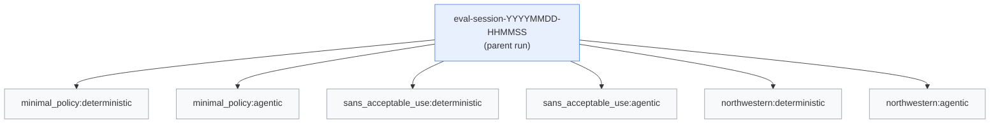
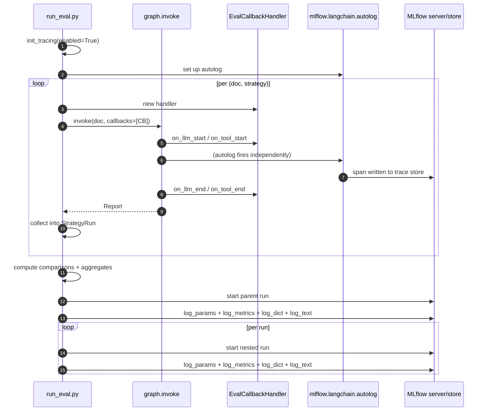

# Evaluation

`ai-auditor` ships a small eval harness that runs both assessment paths
(deterministic and agentic — see [architecture.md](architecture.md) for
what those are) on one or more policy PDFs and compares them. This
document explains what the harness measures, how to run it, and how to
read the output.

> **Scope of the eval.** Comparative, not absolute. Without expert-
> annotated labels we can't say "the deterministic path was *right*" —
> we can only say "the two paths agreed on *N*% of controls, and here
> are the ones where they disagreed." That distinction matters when you
> read the numbers.

---

## 1. What gets measured

### Agreement (deterministic vs agentic)

For each control in the corpus, both paths produce a coverage verdict
(`covered` / `partial` / `not_covered`). Three metrics summarise the
pair:

- **Agreement %.** Fraction of controls where both paths returned the
  same coverage class. Easy to read, but doesn't account for chance
  agreement on the dominant class.
- **Cohen's kappa.** Chance-corrected agreement on the 3×3 confusion
  matrix of coverage classes. `1.0` = perfect agreement, `0` = agreement
  at chance level, negative = worse than chance. Implemented without
  scikit-learn in `evaluation/metrics.py` — the math is textbook.
- **Evidence Jaccard.** For the controls where *coverage* matches, how
  much do the cited `section_id` sets overlap. Reported as a mean across
  matched controls. Catches the case where both paths say "covered" but
  point at different parts of the policy. Section-level granularity
  means two paths that cite different chunks inside the same section
  now count as agreement — closer to semantic agreement than the old
  chunk-level Jaccard.

The disagreement matrix (counts of each `(deterministic, agentic)`
coverage pair where they differ) tells you *how* they disagree — e.g.
"the agent tends to downgrade `covered` to `partial`."

### Performance (per run)

Captured live during `graph.invoke` by `EvalCallbackHandler` (a
LangChain `BaseCallbackHandler`):

- `wall_time_s` — end-to-end graph duration.
- `n_llm_calls` — total LLM invocations. For the deterministic path
  this is `n_controls` (+ retries); for the agentic path it's
  `n_controls × iterations_per_control`.
- `tool_calls.<tool_name>` — per-tool counts. Only populated for the
  agentic path (deterministic has no tools). Useful for comparing
  agent behaviour across documents.

These are *not* traces — they're cheap scalar counters. Traces live
separately in MLflow's trace store (Section 4).

---

## 2. Running an eval

```bash
make eval             # small 6-control corpus, three sample PDFs
make eval-full        # full 33-control corpus, three sample PDFs
```

Or directly:

```bash
uv run python scripts/run_eval.py                              # defaults
uv run python scripts/run_eval.py \
    --docs data/examples/minimal_policy.pdf                    # subset
uv run python scripts/run_eval.py \
    --controls data/controls/iso27001_annex_a_small.yaml       # small corpus
```

Flags:

| Flag         | Default                                     | Purpose                            |
| ------------ | ------------------------------------------- | ---------------------------------- |
| `--docs`     | three sample PDFs under `data/examples/`    | Policies to evaluate               |
| `--controls` | `settings.controls_path`                    | Override the control corpus        |
| `--verbose`  | off                                         | Debug logging                      |

### What each run does

For every `(doc, strategy)` pair the harness:

1. Compiles a graph with the requested `agentic` flag.
2. Runs `graph.invoke(document_path=doc)` with an `EvalCallbackHandler`
   attached to the `config["callbacks"]` list.
3. Collects the resulting `Report`, wall time, and counter values into
   a `StrategyRun` dataclass.

After all runs finish, per-doc `DocComparison`s and a session-level
`AggregateMetrics` are computed, everything is logged to MLflow (Section
3), and a Rich summary table is printed to the terminal.

### Where the output goes

**MLflow only.** There is no local `out-eval/` directory — all eval
artefacts (metrics JSON, session Markdown, per-run reports) live under
the MLflow run. If `MLFLOW_TRACKING_URI` is empty, MLflow writes to the
local `./mlruns` file store; if it's set (e.g. `http://mlflow:5000`
under compose) the logger ships to that server.

### Cost

On `qwen2.5:7b-instruct` with a CPU-only Ollama, expect:

- `make eval` — ~1–2 minutes (6 controls × 3 docs × 2 strategies, with
  the agentic path running up to 6 iterations per control).
- `make eval-full` — ~5–10 minutes (33 controls × 3 docs × 2
  strategies). The agentic path dominates wall time.

GPU-backed Ollama is substantially faster.

---

## 3. MLflow schema

One eval session produces one parent run with N nested children.



### Parent run — `eval-session-<timestamp>`

| Kind     | Key                                      | Meaning                                  |
| -------- | ---------------------------------------- | ---------------------------------------- |
| param    | `ollama_model`                           | Model used for every run in the session  |
| param    | `controls_path`                          | Control corpus path                      |
| param    | `doc_count`                              | Number of distinct documents             |
| param    | `strategy_count`                         | Always `2` today                         |
| metric   | `mean_agreement_pct`                     | Mean of per-doc agreement, across docs   |
| metric   | `mean_kappa`                             | Mean Cohen's kappa across docs           |
| metric   | `mean_evidence_jaccard`                  | Mean evidence Jaccard across docs        |
| metric   | `total_wall_time_{strategy}_s`           | Sum of wall time per strategy            |
| metric   | `total_llm_calls_{strategy}`             | Sum of LLM calls per strategy            |
| metric   | `agreement_pct.<doc_stem>`               | Per-doc agreement                        |
| metric   | `kappa.<doc_stem>`                       | Per-doc kappa                            |
| artifact | `metrics.json`                           | Full structured payload                  |
| artifact | `report.md`                              | Pretty session report                    |

### Child run — `<doc_stem>:<strategy>`

| Kind     | Key                      | Meaning                                          |
| -------- | ------------------------ | ------------------------------------------------ |
| param    | `doc`                    | Document filename                                |
| param    | `strategy`               | `deterministic` or `agentic`                     |
| metric   | `wall_time_s`            | End-to-end graph wall time                       |
| metric   | `n_llm_calls`            | Total LLM invocations                            |
| metric   | `total_tool_calls`       | Sum across tool names (agentic only)             |
| metric   | `tool_calls.<tool_name>` | Per-tool count (agentic only)                    |
| artifact | `report.json`            | That run's `Report` Pydantic model               |
| artifact | `report.md`              | Pretty-rendered per-run Markdown                 |

### Traces (autolog)

`mlflow.langchain.autolog()` runs in parallel with the callback
handler. Every LLM call and every tool invocation becomes a span in
MLflow's trace store. For the agentic path, the `@mlflow.trace` parent
span on `run_retrieval_agent` groups all spans for one control under a
single trace tagged with `control_id`.

Use the **Traces** tab in the MLflow UI to open a specific control's
decision tree; use the **Runs** tab to compare aggregate metrics across
sessions.

---

## 4. How the logging works

The eval harness and MLflow are connected in three distinct ways — it's
worth knowing which is which when debugging a missing number.



- **The callback handler (`EvalCallbackHandler`)** is how the harness
  gets its scalar counters. It does **not** talk to MLflow itself — the
  CLI reads its counters and calls `log_metric` afterwards.
- **Autolog (`mlflow.langchain.autolog()`)** fires on the same events
  but writes spans to the MLflow **trace** store. It's completely
  independent of the callback handler.
- **The session logger (`log_session`)** opens the parent run, writes
  params/metrics/artefacts, and opens a nested run for each
  `StrategyRun`. This is where everything explicit (not a trace) lands.

If a scalar isn't showing up, check the logger. If a trace isn't
showing up, check `init_tracing` ran and `MLFLOW_TRACKING_URI` is set
correctly.

---

## 5. Reading the results

### Via the MLflow UI

```bash
make mlflow-ui              # local ./mlruns (not Docker)
# — or —
make compose-up             # starts the MLflow server at :5000
```

Open `http://localhost:5000`, switch to the `ai-auditor` experiment,
and you'll see parent runs grouped by session timestamp. Open one to
see the nested children and the artefacts.

The **Traces** tab shows the autolog spans, searchable by
`control_id` tag (agentic path only for that tag; deterministic traces
are anonymous).

### Via the MLflow API

```python
import mlflow
mlflow.set_experiment("ai-auditor")
runs = mlflow.search_runs(filter_string="tags.mlflow.runName LIKE 'eval-session-%'")
runs[["run_id", "metrics.mean_agreement_pct", "metrics.mean_kappa"]].head()
```

Useful when comparing many sessions (e.g. after a prompt change) or
when scripting a regression check.

### What to look for

- **Agreement < 60%.** The two paths are disagreeing a lot. Usually
  means the deterministic queries are missing evidence that the agent
  finds via `read_section`.
- **Kappa near 0 with high agreement %.** The corpus is dominated by
  one coverage class (usually `covered`) so both paths trivially agree.
  Look at the disagreement matrix to see if that's the case.
- **Low evidence Jaccard despite high coverage agreement.** The paths
  reach the same verdict through different citations. Often a signal
  that the model is confident without the retrieval being
  well-targeted.

---

## 6. Limitations

- **No ground truth.** Every metric compares one strategy to another,
  never to a gold label. An agreement of 100% means the two paths
  behave the same, not that they're both right.
- **No statistical significance testing.** With three sample PDFs and
  33 controls we're well under the sample size needed for meaningful
  confidence intervals. Treat numbers as directional, not conclusive.
- **LLM stochasticity.** Both paths set `temperature=0.0`, but Ollama's
  determinism is not bit-exact across versions. Numbers wobble run to
  run; single-run comparisons can be misleading.
- **Executive summary excluded.** The eval runs with `skip_summary=True`
  so the `synthesize` LLM call doesn't add noise. Summary-quality eval
  would need its own harness.

Closing these gaps would need expert-annotated test data and a larger
corpus — explicitly out of scope for the current project.

---

## 7. Extending the eval

**Add a new metric.**
Add the computation to `evaluation/metrics.py`, pipe it through
`compare_docs` / `aggregate`, and add a `log_metric` call in
`evaluation/mlflow_logger.py`. The structured `metrics.json` payload
is built in `scripts/run_eval.py::_build_metrics_payload`.

**Log a new artefact.**
In `mlflow_logger.py`, call `mlflow.log_text` (Markdown/text),
`mlflow.log_dict` (JSON-serialisable), or `mlflow.log_figure`
(matplotlib) inside the `with mlflow.start_run(...)` block for either
the parent or the nested child, depending on scope.

**Add a new strategy.**
Today the harness hard-codes "deterministic" and "agentic". To add a
third path, extend the `Strategy` literal in `evaluation/runner.py`,
teach `compile_graph` the new flag, and widen the loop in
`scripts/run_eval.py` so each doc is run under all strategies. The
MLflow schema already keys off `strategy` and will just work.

**Add expert labels.**
The biggest missing piece. A new module with a `GoldAssessment` model
and `vs_ground_truth(report, gold)` that returns per-control accuracy
would slot in alongside the comparative metrics. Everything else in
the pipeline already emits structured assessments — this is additive.
