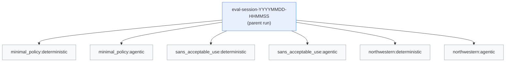

# Evaluation

`ai-auditor` ships a small eval harness that runs both assessment paths
(deterministic and agentic — see [architecture.md](architecture.md) for
what those are) on one or more policy PDFs and compares them. This
document explains what the harness measures, how to run it, and how to
read the output.

> **Scope of the eval.** Comparative, not absolute. Without expert-
> annotated labels we can't say "the deterministic path was *right*" —
> we can only say "the two paths agreed on *N*% of controls, and here
> are the ones where they disagreed." That distinction matters when you
> read the numbers.

---

## 1. What gets measured

### Agreement (deterministic vs agentic)

For each control in the corpus, both paths produce a coverage verdict
(`covered` / `partial` / `not_covered`). Three metrics summarise the
pair:

- **Agreement %.** Fraction of controls where both paths returned the
  same coverage class. Easy to read, but doesn't account for chance
  agreement on the dominant class.
- **Cohen's kappa.** Chance-corrected agreement on the 3×3 confusion
  matrix of coverage classes. `1.0` = perfect agreement, `0` = agreement
  at chance level, negative = worse than chance. Implemented without
  scikit-learn in `evaluation/metrics.py` — the math is textbook.
- **Evidence Jaccard.** For the controls where *coverage* matches, how
  much do the cited `section_id` sets overlap. Reported as a mean across
  matched controls. Catches the case where both paths say "covered" but
  point at different parts of the policy. Section-level granularity
  means two paths that cite different chunks inside the same section
  now count as agreement — closer to semantic agreement than the old
  chunk-level Jaccard.

The disagreement matrix (counts of each `(deterministic, agentic)`
coverage pair where they differ) tells you *how* they disagree — e.g.
"the agent tends to downgrade `covered` to `partial`."

### Performance (per run)

Captured live during `graph.invoke` by `EvalCallbackHandler` (a
LangChain `BaseCallbackHandler`):

- `wall_time_s` — end-to-end graph duration.
- `n_llm_calls` — total LLM invocations. For the deterministic path
  this is `n_controls` (+ retries); for the agentic path it's
  `n_controls × iterations_per_control`.
- `tool_calls.<tool_name>` — per-tool counts. Only populated for the
  agentic path (deterministic has no tools). Useful for comparing
  agent behaviour across documents.

These are *not* traces — they're cheap scalar counters. Traces live
separately in MLflow's trace store (Section 4).

---

## 2. Running an eval

```bash
make eval             # small 6-control corpus, three sample PDFs
make eval-full        # full 33-control corpus, three sample PDFs
```

Or directly:

```bash
uv run python scripts/run_eval.py                              # defaults
uv run python scripts/run_eval.py \
    --docs data/examples/minimal_policy.pdf                    # subset
uv run python scripts/run_eval.py \
    --controls data/controls/iso27001_annex_a_small.yaml       # small corpus
```

Flags:

| Flag         | Default                                     | Purpose                            |
| ------------ | ------------------------------------------- | ---------------------------------- |
| `--docs`     | three sample PDFs under `data/examples/`    | Policies to evaluate               |
| `--controls` | `settings.controls_path`                    | Override the control corpus        |
| `--verbose`  | off                                         | Debug logging                      |

### What each run does

For every `(doc, strategy)` pair the harness:

1. Compiles a graph with the requested `agentic` flag.
2. Runs `graph.invoke(document_path=doc)` with an `EvalCallbackHandler`
   attached to the `config["callbacks"]` list.
3. Collects the resulting `Report`, wall time, and counter values into
   a `StrategyRun` dataclass.

After all runs finish, per-doc `DocComparison`s and a session-level
`AggregateMetrics` are computed, everything is logged to MLflow (Section
3), and a Rich summary table is printed to the terminal.

### Where the output goes

**MLflow only.** There is no local `out-eval/` directory — all eval
artefacts (metrics JSON, session Markdown, per-run reports) live under
the MLflow run. If `MLFLOW_TRACKING_URI` is empty, MLflow writes to the
local `./mlruns` file store; if it's set (e.g. `http://mlflow:5000`
under compose) the logger ships to that server.

### Cost

On `qwen2.5:7b-instruct` with a CPU-only Ollama, expect:

- `make eval` — ~1–2 minutes (6 controls × 3 docs × 2 strategies, with
  the agentic path running up to 6 iterations per control).
- `make eval-full` — ~5–10 minutes (33 controls × 3 docs × 2
  strategies). The agentic path dominates wall time.

GPU-backed Ollama is substantially faster.

---

## 3. MLflow schema

One eval session produces one parent run with N nested children.



### Parent run — `eval-session-<timestamp>`

| Kind     | Key                                      | Meaning                                  |
| -------- | ---------------------------------------- | ---------------------------------------- |
| param    | `ollama_model`                           | Model used for every run in the session  |
| param    | `controls_path`                          | Control corpus path                      |
| param    | `doc_count`                              | Number of distinct documents             |
| param    | `strategy_count`                         | Always `2` today                         |
| metric   | `mean_agreement_pct`                     | Mean of per-doc agreement, across docs   |
| metric   | `mean_kappa`                             | Mean Cohen's kappa across docs           |
| metric   | `mean_evidence_jaccard`                  | Mean evidence Jaccard across docs        |
| metric   | `total_wall_time_{strategy}_s`           | Sum of wall time per strategy            |
| metric   | `total_llm_calls_{strategy}`             | Sum of LLM calls per strategy            |
| metric   | `agreement_pct.<doc_stem>`               | Per-doc agreement                        |
| metric   | `kappa.<doc_stem>`                       | Per-doc kappa                            |
| artifact | `metrics.json`                           | Full structured payload                  |
| artifact | `report.md`                              | Pretty session report                    |

### Child run — `<doc_stem>:<strategy>`

| Kind     | Key                      | Meaning                                          |
| -------- | ------------------------ | ------------------------------------------------ |
| param    | `doc`                    | Document filename                                |
| param    | `strategy`               | `deterministic` or `agentic`                     |
| metric   | `wall_time_s`            | End-to-end graph wall time                       |
| metric   | `n_llm_calls`            | Total LLM invocations                            |
| metric   | `total_tool_calls`       | Sum across tool names (agentic only)             |
| metric   | `tool_calls.<tool_name>` | Per-tool count (agentic only)                    |
| artifact | `report.json`            | That run's `Report` Pydantic model               |
| artifact | `report.md`              | Pretty-rendered per-run Markdown                 |

### Traces (autolog)

`mlflow.langchain.autolog()` runs in parallel with the callback
handler. Every LLM call and every tool invocation becomes a span in
MLflow's trace store. For the agentic path, the `@mlflow.trace` parent
span on `run_retrieval_agent` groups all spans for one control under a
single trace tagged with `control_id`.

Use the **Traces** tab in the MLflow UI to open a specific control's
decision tree; use the **Runs** tab to compare aggregate metrics across
sessions.

